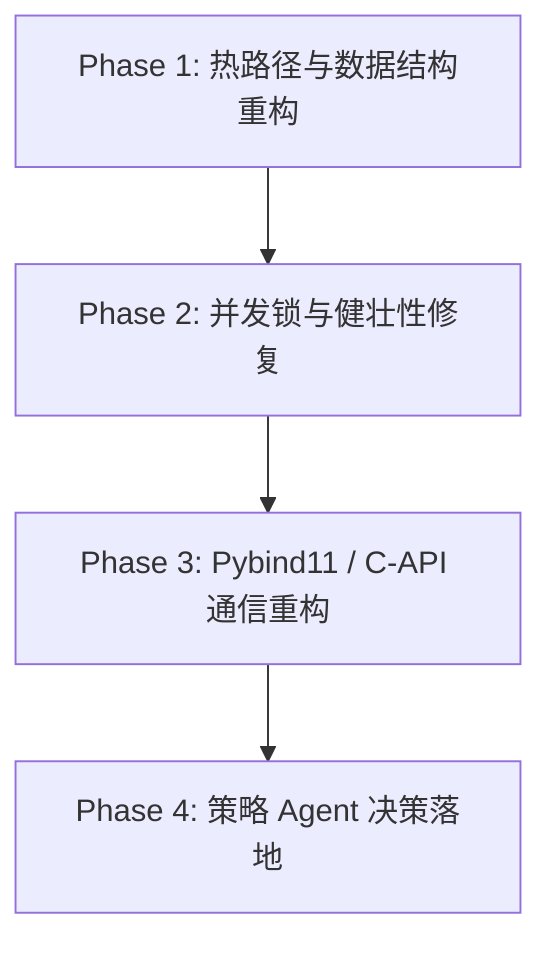

# PLAN_004: LobXChange 核心引擎与架构技术债重构路线图 (Technical Debt Refactoring Roadmap)

> **当前状态（2026-07-26）**：第 1 项已在个人 PR 栈的旧基线上实现，但尚未合入作者 `main`，且不能替代作者新重构到位后的重新审计。其余条目仍是提案，不得据此自动实施。

## 概述与目标

通过对 `LobXChange` 模拟交易所 C++ 核心引擎与 Python 仿真框架的深度走读，梳理出 10 项制约性能、吞吐量、并发安全性及健壮性的核心技术债。

本计划作为**总策划方案**存放在 `docs/pending_plans/` 中，仅用于记录与引导后续的**逐项探讨与小步快跑迭代**。在未经用户讨论确认前，不进行任何破坏性代码修改。

目标：
1. 单笔限价单撮合复杂度由 $O(N)$ 恢复为 $O(\log N)$。
2. 消除跨进程管道 JSON 通信开销，支持 Pybind11 零拷贝直连。
3. 补齐全引擎并发防护锁，保证多线程 Agent 仿真安全。
4. 规范溢出与数值精度计算，保持资金与持仓 PnL 绝对守恒。

---

## 技术债全景图 (Total Technical Debt Inventory)

### 1. [~] 核心撮合热路径：全量状态快照深拷贝 (`make_submit_snapshot`)【个人分支已实现，等待新基线复核】
- **现象**：`MarketEngine::submit_limit` 中每处理一笔限价单，无条件调用 `make_submit_snapshot()` 对全盘口、账本 `AccountLedger` 和持仓 `PositionEngine` 进行深拷贝。
- **影响**：单笔订单处理复杂度由 $O(\log N)$ 退化为 $O(N)$，高频/大盘口下吞吐量崩溃。
- **分支实现**：个人 PR 栈曾在 `cpp/src/market_engine.cpp` 实现路线 A（两阶段纯读预检 + 智能延迟快照）。
- **历史实测**：在 SSH 远端工位 (`gongwei`) 上运行 `lobx_bench_exchange` 50,000 笔订单，曾记录 TPS 从 2,174 升至 **2,619.85 TPS (+20.5%)**，P99 尾部延迟为 1.78ms。该结果只对应当时分支与工位，不表示已合入作者仓库，也不是作者新重构的验证结果。

### 2. 跨进程 IPC 管道与 JSON 序列化瓶颈 (`subprocess.Popen`)
- **现象**：`mesa_exchange.py` 通过 `subprocess.Popen` 调用 C++ 二进制，每下单/查盘口/查余额均走 `stdin`/`stdout` 文本 CSV 与 JSON 编解码。
- **影响**：管道 I/O 阻塞与序列化开销吞没 C++ 高性能优势。
- **拟重构方案**：重构为 Pybind11 / C-API 编译动态库直连或共享内存环形队列。

### 3. 多线程与并发安全性完全缺失 (Lack of Thread Safety)
- **现象**：`Exchange` 与 `MarketEngine` 内部完全没有互斥锁（`std::mutex` / `std::shared_mutex`）或原子变量。
- **影响**：多线程 Agent 并发调用 API 会直接引发 Data Race 与 Segmentation Fault。
- **拟重构方案**：引入细粒度读写锁，支持并发读写与安全隔离。

### 4. 关键清算溢出错误静默吞没 (Swallowed Overflow Errors)
- **现象**：`PositionEngine::apply_trade` 强行使用 `(void)apply_trade_checked(...)` 忽略溢出检查返回值。
- **影响**：成交引发数值溢出时底层返回 `false` 被静默忽视，导致持仓处于不一致的坏状态，破坏资金/持仓守恒。
- **拟重构方案**：妥善传播 `apply_trade` 错误返回值，发生溢出时终止交易并向上层返回 RejectCode。

### 5. 历史成交与 K 线 Vector 无界积聚 (Unbounded Vector Memory Growth)
- **现象**：`Exchange` 内部 `trade_history_` 和 `candle_history_` 未在内部限制容量。
- **影响**：长周期仿真若外部未主动调用 `drain`，会导致内存无休止增长引发 OOM。
- **拟重构方案**：设置容量上限与环形覆盖机制，提供自动排水配置。

### 6. 热路径字符串 Hash 查找开销 (String Key Lookup Overhead)
- **现象**：`Exchange::submit_limit` 等 API 入参为 `const std::string& market_symbol`，每次在 `engines_` 哈希表按字符串 Hash 查找。
- **影响**：频繁字符串哈希拖慢热路径。
- **拟重构方案**：初始化阶段将 Symbol 转换为 `MarketId` (uint32_t)，热路径直接按整数 Handle 访问数组。

### 7. 持仓均价浮点数强转舍入误差 (`long double` Casting)
- **现象**：`PositionEngine::apply_trade_checked` 计算加权平均成本价时强转为 `long double` 计算后再转回 `lob::Tick`。
- **影响**：可能存在 1 Tick 的跨平台/跨编译器舍入偏差，破坏确定性复现。
- **拟重构方案**：采用带有溢出校验的 128 位整数 (`__int128_t`) 定点计算。

### 8. 数据结构嵌套与 CPU Cache 连续性破坏 (Nested Map Overhead)
- **现象**：`AccountLedger` 与 `PositionEngine` 内部使用双层嵌套 `std::unordered_map`；`AgentStateStore` 使用 `std::vector` + `std::remove_if`。
- **影响**：引发大量 CPU Cache Miss 与内存重排前移。
- **拟重构方案**：重构为一维平坦数组、对象池或平坦哈希映射。

### 9. 日志与事件格式化开销 (`std::ostringstream`)
- **现象**：在热路径直接使用 `std::ostringstream` 动态拼接格式化 Key-Value 字符串。
- **影响**：频繁内存分配与 ASCII 转换开销。
- **拟重构方案**：使用预分配字符 Buffer 或 FlatBuffers / Protobuf 二进制序列化。

### 10. Python 生态 Agent 决策逻辑占位 (Skeleton Placeholders)
- **现象**：`mesa_model.py` 中 `GridBotAgent`、`FundingArbitrageAgent`、`LiquidationSniperAgent` 等 Agent `step()` 为 `pass`。
- **影响**：复杂博弈仿真策略尚未真正落地。
- **拟重构方案**：分批补全各类策略 Agent 的逻辑。

---

## 4 阶段演进路线图 (Phase Breakdown)

1. **Phase 1**：解决 $O(N)$ 快照深拷贝、嵌套 Map 平坦化、字符串 Lookup 消除、无界内存防护。
2. **Phase 2**：引入多线程读写锁防护、修复 `apply_trade` 溢出吞没、128 位整数持仓成本价计算。
3. **Phase 3**：重构 Python-C++ 交互，引入 Pybind11 零拷贝直连与预分配日志 Buffer。
4. **Phase 4**：补全 Python 策略 Agent 的 `step()` 交易逻辑。

---

## 探讨与交互规范

- **逐项讨论**：后续将针对每一个 Phase 和具体技术债条目，与用户逐一讨论设计细节与代码改动边界。
- **边界控制**：遵循“小步快跑、敬畏技术、不动大底盘”原则，每次讨论确认后方可编写相关代码与测试。
