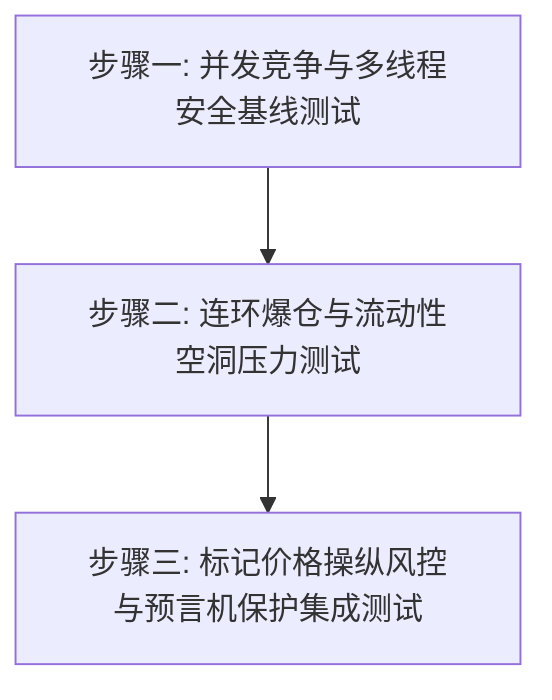

# PLAN_005: 模拟交易所测试覆盖度与真实 Web3 交易所 Gap 补全路线图 (Audited Step-by-Step Testing Plan)

## 1. 概述与定位

本计划通过对比 `LobXchange` 模拟交易所当前已有的单元测试/集成测试，精确审计出“真正缺失且当前可直接补充的测试场景”。

为了避免“无源之水”的过度设计（即测试尚未在底层实现的功能），我们对测试需求进行了分层审计，将计划分为两个主要部分：
1. **当前可直接补充的测试 (Directly Implementable Steps)**：底层已有相关业务逻辑，但缺乏极端、边界或并发场景的测试覆盖。
2. **未来待补充的测试 (Future Gaps - Feature Dependent)**：由于当前 C++ 引擎尚不支持该业务特性，需等未来对应特性开发完毕后，方能补充相应测试。

---

## 2. 核心测试 Gap 审计清单 (Audit of Existing Tests vs Gaps)

经过对 [cpp/tests/](file:///Users/mac/模拟交易所项目/cpp/tests/) 目录下 100+ 个测试文件的全局走读与匹配审计，以下是差距核验结果：

| 测试领域/步骤 | 现有测试文件与逻辑 | 是否属于重复测试？ | 审计结论 |
| :--- | :--- | :--- | :--- |
| **步骤一：并发竞争测试** | 新增 [concurrent_market_engine_test.cpp](file:///Users/mac/模拟交易所项目/cpp/tests/concurrency/concurrent_market_engine_test.cpp)，建立多线程竞争崩溃基准。 | ❌ **不重复** | ✅ **[x] 已完成** |
| **步骤二：流动性空洞与强平坏账** | 新增 [perp_liquidation_stress_test.cpp](file:///Users/mac/模拟交易所项目/cpp/tests/integration/perp_liquidation_stress_test.cpp)，验证 Depth=0 时 ADL 广播与资金 100% 守恒。 | ❌ **不重复** | ✅ **[x] 已完成** |
| **步骤三：标记价格操纵风控** | 新增 [oracle_mark_price_protection_test.cpp](file:///Users/mac/模拟交易所项目/cpp/tests/integration/oracle_mark_price_protection_test.cpp)，验证 IndexPrice 防插针拦截与 Mode 切换。 | ❌ **不重复** | ✅ **[x] 已完成** |
| **未来步骤：断线自撤 (COD)** | 底层撮合为纯内存计算，目前无任何网络链接、会话上下文或心跳定时器逻辑。 | ❌ **不重复（但目前不适用）** | **暂缓补充**。需等底层实现网络通信层/Mock 连接层后进行。 |
| **未来步骤：混合保证金质押** | 底层每一市场固定绑定单一 `market.margin_asset`，尚不支持多币种质押和 Haircut 折价率。 | ❌ **不重复（但目前不适用）** | **暂缓补充**。需等底层实现统一账户/混合保证金结构后进行。 |
| **未来步骤：逐仓与分级平仓** | 当前强平为粗暴的一次性全清，底层不支持 Isolated Margin 隔离账户和阶梯减仓逻辑。 | ❌ **不重复（但目前不适用）** | **暂缓补充**。需等底层实现分级平仓和 Isolated 模式后进行。 |

---

## 3. 落地推进 3 步走计划 (Actionable Roadmap)

我们移除不可直接实施的步骤，聚焦于以下 3 个**完全缺失、底层有业务逻辑、可直接开发**的测试用例：



### 步骤一：并发竞争与线程安全锁基线测试 (Step 1: Concurrency & Thread Safety Base Test)
* **背景与目标**：当前核心引擎无并发保护，虽然有 `ScalarUndoScope`，但全部测试在单线程下跑，容易隐藏 Race Condition。
* **用例设计**：
  * 新建 [concurrent_market_engine_test.cpp](file:///Users/mac/模拟交易所项目/cpp/tests/concurrency/concurrent_market_engine_test.cpp)。
  * 启动 4 个读线程并发调用 `simulate_fill` 估算滑点，4 个写线程并发调用 `submit_limit` 和 `cancel` 下单与撤单。
  * **验证断言**：运行此并发用例，捕获死锁或数据损坏的报错，确立并发测试基线。
* **验证命令**：
  ```bash
  ctest --test-dir build -R concurrent_market_engine_test --output-on-failure
  ```

### 步骤二：连环爆仓与流动性空洞压力测试 (Step 2: Cascade Liquidation & Empty Book Stress Test)
* **背景与目标**：在买单盘口完全没有任何挂单深度（Depth = 0）时，强平引擎以市价抛售爆仓大户仓位时，验证 ADL 的强制自动对冲结算和穿仓坏账社会化分摊。
* **用例设计**：
  * 新建 [perp_liquidation_stress_test.cpp](file:///Users/mac/模拟交易所项目/cpp/tests/integration/perp_liquidation_stress_test.cpp)。
  * 强制将买单队列清空。将穿仓基金清零。使大户 Alice 触发强平。
  * **验证断言**：验证强平单因无对手方无法在簿记中成交后，系统是否自动将被强平头寸划转扣减至盈利最高的空头 Bob 账户中（ADL 自动减仓流程）。验证最终账本在 ADL 扣减及坏账产生时的 `accounting_invariant_ok` 资金完全守恒。
* **验证命令**：
  ```bash
  ctest --test-dir build -R perp_liquidation_stress_test --output-on-failure
  ```

### 步骤三：标记价格操纵风控与预言机保护集成测试 (Step 3: Oracle & Mark Price Wind Control Integration Test)
* **背景与目标**：防止大户通过“对倒”刷出异常最新价，强行爆仓盘口中其他正常用户的持仓。
* **用例设计**：
  * 新建 [oracle_mark_price_protection_test.cpp](file:///Users/mac/模拟交易所项目/cpp/tests/integration/oracle_mark_price_protection_test.cpp)。
  * 模拟 Alice 提交巨量市价单把盘口最新价（LTP）拉升 50%，但维持外部 Index Price 稳定。
  * **验证断言**：验证在标记价格模式设置为 `IndexPrice` 时，爆仓判定组件重估持仓价值依旧使用 Index Price，使得其他普通用户**不被触发强平**。
* **验证命令**：
  ```bash
  ctest --test-dir build -R oracle_mark_price_protection_test --output-on-failure
  ```

---

## 4. 全量回归基准 (Regression Testing)

每完成一步测试用例补充，均需运行全量回归，确保不影响原有已通过的 43 项构建目标与 250+ 历史断言：
```bash
ctest --test-dir build --output-on-failure
```
